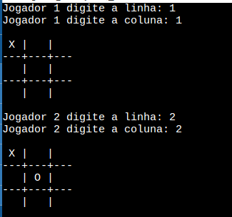
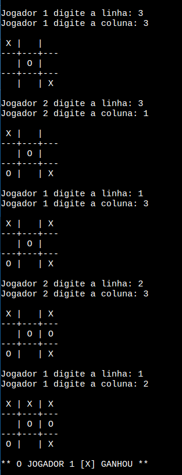

# jogo-da-velha

Atividade proposta na disciplina de Lógica de Programação, na Universidade Federal de São Paulo

## Atividade
A atividade consistia em desenvolver um jogo da velha. Achei interessante o formato de como desenvolvi esta atividade e gostaria de publicá-la aqui.

## Ferramentas e Linguagens
- Linguagem: C
- IDE: Replit

## Como ficou o projeto
- Quando o jogo é iniciado, ele pede para o jogador 1 indicar sua linha e sua coluna a qual deseja marcar.

  
- Depois pede para o jogador 2 informar as posições. E assim o jogo se mantém, até ter um vencedor ou dar velha.

  

## Novas atualizações
- Em novas versões deste código, poderá ser possível, por exemplo, informar o nome de cada jogador, para que o programa informe quem ganhou pelo nome.

---

  
  

